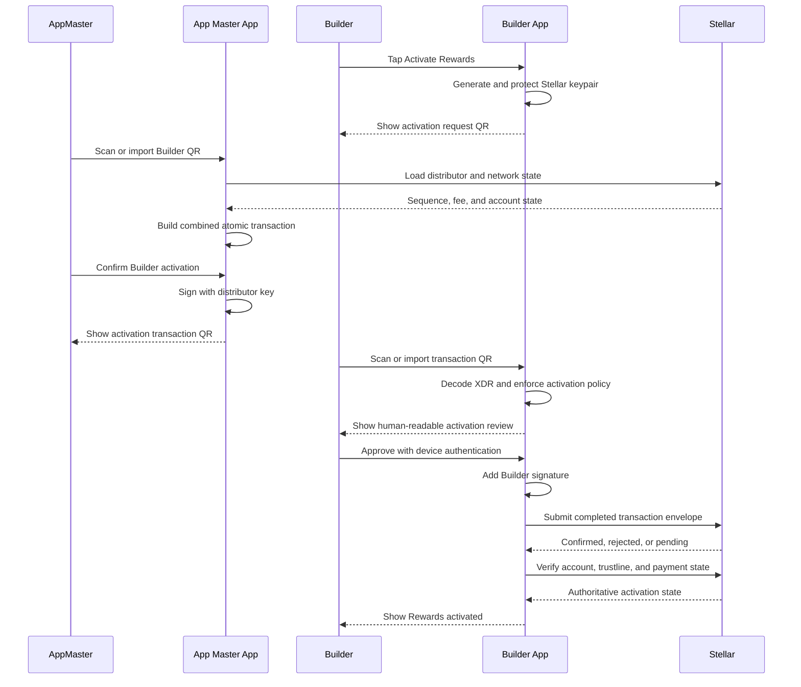

# Mobile-to-Mobile QR Activation Handshake Specification

## Status

This document specifies the proposed mobile-to-mobile Rewards activation handshake. It is a design specification and is not yet implemented.

It replaces PC-assisted provisioning, temporary activation passcodes, encrypted access files, and private-key transfer with an atomic, partially signed Stellar transaction exchanged between two mobile applications through QR.

## Applications

### Builder App

The Builder App:

- generates the Builder Stellar keypair locally;
- protects the secret key on the Builder device;
- displays an activation-request QR containing the Builder public key;
- scans an activation-package QR or imports one from an image;
- validates every transaction field before signing;
- signs only with the Builder key; and
- submits the completed transaction directly to Stellar.

### App Master App

The App Master App:

- provides both a Distributor Dashboard and the complete User Wallet surface;
- scans or imports the Builder activation request;
- uses the configured distributor account to fund activation;
- builds the combined Stellar transaction package;
- signs the distributor-authorized operations locally;
- displays the partially signed transaction as a QR; and
- never exports the distributor secret key.

Neither operator needs to understand Stellar accounts, reserves, trustlines, XDR, transaction sources, or signatures. Those concepts remain internal to the applications.

## App Master App Screen Surfaces

The App Master App is a dual-surface test application. It must expose both the distributor behavior and the same Builder wallet behavior being developed in the User App. This allows one App Master device to test both roles without maintaining a second UI implementation.

### Distributor Dashboard

The Distributor Dashboard shows:

- active Stellar network;
- distributor public account ID;
- distributor total and available XLM balance;
- current minimum reserve and estimated activation capacity;
- configured Rewards asset code and issuer;
- distributor Rewards balance available for activation payments;
- pending, confirmed, expired, and failed activation requests;
- Builders whose Rewards trustlines are visible on the ledger; and
- refresh status and last authoritative ledger update.

Each Builder row or detail view shows safe public information:

- Builder display name and phone number when locally associated with the request;
- Builder public account ID;
- activation request ID;
- account-exists status;
- Rewards trustline status;
- XLM balance;
- Rewards balance;
- activation transaction hash and outcome; and
- created or last-refreshed time.

Distributor actions include:

- **Activate Builder**;
- scan a live `activation_request` QR;
- import an `activation_request` QR image;
- review the exact direct-funding amount and initial Rewards amount;
- build and sign the activation transaction;
- display the `activation_transaction` QR;
- save/export the generated QR image;
- reconcile a pending activation; and
- inspect a safe transaction summary.

The Distributor Dashboard must never display or export the distributor secret key.

### User Wallet

The App Master App also contains the same User Wallet screen flow as the Builder App:

- not activated;
- activation request QR;
- activation transaction scan/import and review;
- activation submission and outcome;
- Rewards overview;
- receive QR;
- send scan/import, amount, review, authorization, and outcome;
- transaction history;
- locked state; and
- local wallet removal.

The User Wallet must reuse the same feature components, state contracts, QR parser, transaction validator, and SDK boundary as the standalone Builder experience. It must not be a separate mock or divergent implementation.

### Test Navigation

During development, the App Master App may expose an explicit role switcher:

```text
App Master App
|-- Distributor
`-- User Wallet
```

The switcher changes the visible feature surface only. It must not copy keys between roles or allow the User Wallet controller to access the distributor secret. Production access to the Distributor surface requires a separate authorization and release-policy decision.

## Security Boundary

| Material | Builder App | App Master App | QR exchange |
| --- | --- | --- | --- |
| Builder secret key | Generate and retain | Never receives | Forbidden |
| Builder public key | Display and validate | Receive and bind | Allowed |
| Distributor secret key | Never receives | Retain and use locally | Forbidden |
| Activator/distributor public key | Read from and validate against the transaction | Own and sign with its matching key | Allowed |
| Partially signed transaction envelope | Validate and complete | Build and sign | Allowed |
| Rewards asset configuration | Validate against allowlist | Build from approved configuration | Allowed |

The activating account public key is not a preinstalled trust anchor. It is read from the transaction package and must match the transaction source and included signature. Trust comes from strict transaction-policy validation plus the configured Rewards network, asset code, and issuer. Any account able to satisfy that policy and fund the transaction may act as the activating peer.

## QR Artifact Types

All QR artifacts use a versioned typed envelope:

```json
{
  "protocol": "thebuilderpros",
  "version": 1,
  "type": "activation_request",
  "id": "unique-message-id",
  "issuedAt": "2026-09-18T00:00:00Z",
  "expiresAt": "2026-09-18T00:10:00Z",
  "payload": {}
}
```

Initial types:

| Type | Producer | Consumer | Purpose |
| --- | --- | --- | --- |
| `activation_request` | Builder App | App Master App | Supply the new Builder public key and request identity |
| `activation_transaction` | App Master App | Builder App | Supply the validated, distributor-signed transaction envelope |
| `rewards_receive` | Receiving Builder App | Sending Builder App | Supply a public Rewards recipient |

Each application must route by `type` before parsing its payload. An artifact from one flow must never be accepted by another flow.

## End-to-End Activation

### 1. Builder App Generates the Wallet Keypair

The Builder enters the minimum approved identity information and taps **Activate Rewards**.

The Builder App:

1. generates a cryptographically secure Stellar keypair locally;
2. protects the secret key using platform-backed secure storage;
3. generates a random activation-request ID and expiration;
4. records the expected network and Rewards asset configuration; and
5. displays an `activation_request` QR.

Example public request payload:

```json
{
  "requestId": "random-one-time-id",
  "builderName": "Builder name",
  "phoneNumber": "+95...",
  "builderPublicKey": "G...",
  "network": "testnet",
  "supportedProtocolVersions": [1]
}
```

The request contains no Builder secret key, recovery phrase, wallet passcode, device credential, or reusable privileged token.

### 2. App Master App Builds One Combined Transaction

The App Master scans the live activation QR or imports a saved QR image. The App Master App validates:

- protocol name and version;
- artifact type;
- request ID and expiration;
- Builder public-key encoding;
- configured Stellar network;
- duplicate or previously completed request status; and
- operator confirmation of the displayed Builder identity.

The App Master App then loads current ledger state and constructs one classic Stellar transaction with the distributor as the transaction source and fee payer.

The first-release activation model uses direct funding. The intended atomic operation order is:

```text
1. CreateAccount
   source: Distributor
   destination: Builder public key
   starting balance: approved XLM activation amount

2. ChangeTrust
   source: Builder
   asset: configured Rewards asset and issuer

3. Payment
   source: Distributor
   destination: Builder
   asset: configured Rewards asset
   amount: approved activation amount
```

This sequence represents:

- **Distributor sign-off:** pay the transaction fee and directly fund the Builder's account reserve;
- **Builder action:** accept the Rewards trustline; and
- **Initial Rewards:** transfer the configured token amount after the trustline exists.

After confirmation, the funded XLM belongs to the Builder account. There is no continuing sponsorship relationship between the activating account and Builder. The approved amount must cover the current account reserve, trustline reserve, expected transaction fees, and the product's safety margin.

The exact operation set must be generated from live Stellar rules and tested against the selected network. If the Rewards issuer requires explicit trustline authorization, the required issuer-authorized operation and signature must be included or the one-transaction design must be revised.

The transaction must include:

- current distributor sequence number;
- explicit network passphrase;
- bounded time window;
- appropriate base or fee-bump fee policy;
- operation sources as specified;
- the exact Builder public key from the activation request; and
- no unreviewed memo or extra operation.

Stellar transactions are atomic: if any included operation fails, none of the operations are applied.

### 3. App Master Signs and Encodes the Package

The App Master App signs the transaction envelope with the distributor key. It does not and cannot add the Builder signature.

It wraps the partially signed XDR in an `activation_transaction` artifact:

```json
{
  "requestId": "same-random-one-time-id",
  "builderPublicKey": "G...",
  "distributorPublicKey": "G...",
  "network": "testnet",
  "assetCode": "REWARD",
  "assetIssuer": "G...",
  "initialAmount": "100.0000000",
  "transactionXdr": "base64-partially-signed-envelope",
  "transactionHash": "hex-hash-before-builder-signature"
}
```

The App Master App displays the artifact as a QR image and may save or export that QR image for controlled offline delivery.

If the encoded envelope exceeds reliable single-QR capacity, the protocol must use a standardized multipart or animated QR representation with:

- message ID;
- total-part count;
- part index;
- whole-message digest; and
- duplicate and missing-part detection.

Silent truncation or an ad hoc unversioned split format is forbidden.

### 4. Builder Imports and Validates the Transaction

The Builder App accepts the activation transaction through either:

- live camera scanning; or
- selecting a QR image from the device gallery or file picker.

Both input paths must feed the same decoder, schema validator, transaction parser, policy validator, and signing confirmation screen. Image import must not bypass any live-scan security check.

Before signing, the Builder App independently decodes the XDR and verifies:

- the transaction is a classic Stellar transaction for the configured network;
- the transaction source and existing signature belong to the same activating account represented by the package;
- the request ID and Builder public key match the active local activation attempt;
- the transaction has not expired;
- the Builder account does not already conflict with ledger state;
- the operation count and order exactly match the approved activation template;
- every operation source is expected;
- `CreateAccount` targets the Builder public key;
- `CreateAccount` uses exactly the approved direct-funding amount;
- `ChangeTrust` uses the allowlisted Rewards asset and issuer;
- `Payment` sends the exact approved asset and amount to the Builder;
- no native XLM or other asset is transferred away from the Builder;
- no signer, threshold, home-domain, account-data, clawback, merge, offer, contract, or unrelated operation is present;
- time bounds, fees, sequence number, and memo satisfy policy; and
- the distributor signature is valid for the final transaction hash and network passphrase.

The Builder-facing review screen shows safe product language, for example:

```text
Activate Builder Rewards

App Master will:
- set up your Rewards account
- add the XLM required to keep your Rewards account active
- connect Builder Rewards
- add 100 Rewards

No other transfer or permission change is included.
```

The UI must not ask the Builder to approve an opaque QR or raw XDR.

### 5. Builder Signs and Submits

After explicit Builder approval and required device authentication, the Builder App:

1. signs the already validated transaction with the locally protected Builder key;
2. preserves the existing distributor signature;
3. verifies that the signature set is exactly the expected set;
4. submits the completed transaction directly to the configured Stellar endpoint;
5. records the transaction hash and request ID for idempotency; and
6. reconciles confirmed, rejected, and ambiguous outcomes.

The Builder App reports activation success only after authoritative ledger verification confirms:

- the Builder account exists;
- the expected directly funded XLM balance and reserve state exist;
- the approved Rewards trustline exists; and
- the expected initial Rewards payment succeeded.

## Sequence Diagram



## QR Image Import

QR image import is a first-class input method, not a fallback with reduced validation.

The import flow must:

1. request a user-selected image through the platform picker;
2. decode QR content locally;
3. reject zero-code and ambiguous multi-code images;
4. apply the same payload and XDR limits as camera scanning;
5. show the decoded artifact type before any action;
6. never upload the image for decoding unless a separately approved privacy design permits it; and
7. discard decoded image buffers when processing completes.

Imported screenshots may be stale or replayed, so expiration, request binding, ledger state, sequence number, and replay validation remain mandatory.

## Activation States

```text
NOT_ACTIVATED
    -> ACTIVATION_REQUEST_READY
    -> TRANSACTION_PACKAGE_RECEIVED
    -> BUILDER_APPROVAL_REQUIRED
    -> SUBMISSION_PENDING
    -> ACTIVATED_LOCKED
```

| State | Meaning |
| --- | --- |
| `NOT_ACTIVATED` | No protected Builder key or active request |
| `ACTIVATION_REQUEST_READY` | Builder key exists locally and public request QR is available |
| `TRANSACTION_PACKAGE_RECEIVED` | QR decoded and bound to the active request |
| `BUILDER_APPROVAL_REQUIRED` | Transaction passed policy validation and awaits local authorization |
| `SUBMISSION_PENDING` | Completed envelope was submitted or has an ambiguous outcome |
| `ACTIVATED_LOCKED` | Account, direct funding, trustline, and initial payment are verified |

Activated wallets restore locked. Private signing capability is never restored into an unlocked session automatically.

## Replay and Concurrency Rules

- Each activation request has one random request ID and short expiration.
- A new request invalidates the prior active request locally.
- The App Master App must not knowingly build multiple packages for the same request.
- The Builder App must store the submitted transaction hash before network submission.
- An ambiguous submission is reconciled before another activation transaction is accepted.
- A stale distributor sequence number requires a newly built and re-signed package.
- The Builder App must never modify a signed transaction and retain the old distributor signature.

## Failure Handling

- Invalid or unknown QR type: reject without changing activation state.
- Invalid distributor identity or signature: reject and warn the Builder.
- Wrong Builder public key or request ID: reject as a substitution attempt.
- Expired transaction: request a newly generated package.
- Unexpected operation: reject the entire package.
- Insufficient distributor XLM or Rewards balance: App Master App reports provisioning failure and creates no QR.
- Invalid asset or issuer: reject on both applications.
- Submission timeout: store as pending and reconcile by transaction hash; do not blindly resubmit.
- Ledger rejection: show a safe outcome and require a fresh transaction package when sequence or time bounds are consumed.

## Relationship to Rewards Send and Receive

The same QR scanning, image-import, type-routing, schema-validation, and safe-error infrastructure supports `rewards_receive` artifacts.

Activation and transfer remain separate protocols:

```text
activation_request
    Builder public setup request

activation_transaction
    Multi-source, partially signed provisioning transaction

rewards_receive
    Public recipient details for an ordinary Rewards send
```

An activation transaction must never enter the ordinary send flow, and a receive artifact must never enter the activation signer.

## Explicit Non-Goals

- No PC application
- No application backend
- No Bluetooth requirement
- No private-key QR codes
- No App Master treasury key on the Builder device
- No Builder secret key on the App Master device
- No temporary activation passcode
- No encrypted access-file exchange
- No opaque signing of arbitrary XDR
- No automatic approval immediately after scanning

## Definition of Done

- Both applications complete the flow using live QR scanning.
- Both applications support QR image import through the same validation path.
- Builder and distributor secret keys never leave their originating devices.
- The App Master App produces the exact allowlisted atomic transaction template.
- The Builder App independently decodes and validates every XDR field and operation.
- All signatures required by the final operation set are preserved and accepted by Stellar.
- Tampered, substituted, replayed, expired, wrong-network, wrong-asset, and extra-operation packages are rejected.
- Activation success is based on authoritative ledger state, not QR parsing or submission alone.
- Unit tests cover canonical payloads, XDR policy validation, signature validation, and multipart QR assembly if used.
- Integration tests run the complete handshake on Stellar testnet using two physical mobile devices.
- A security review approves key storage, QR parsing, transaction policy, signing, replay handling, and recovery behavior before mainnet use.

## Open Decisions

1. Is the distributor also the Rewards issuer, or are they separate accounts?
2. Does the issuer require explicit trustline authorization?
3. What exact XLM activation amount and safety margin are required?
4. What exact initial Rewards amount is included?
5. Which account is the transaction source and fee payer under the final transaction template?
6. Will a fee-bump envelope be used for later Rewards transactions?
7. Which accounts are allowed to activate peers: only the initial App Master account or any sufficiently funded activated Builder?
8. What QR binary encoding and compression are used for XDR?
9. At what payload size does the protocol switch to multipart or animated QR?
10. What is the lost-device and Builder-key recovery policy?
