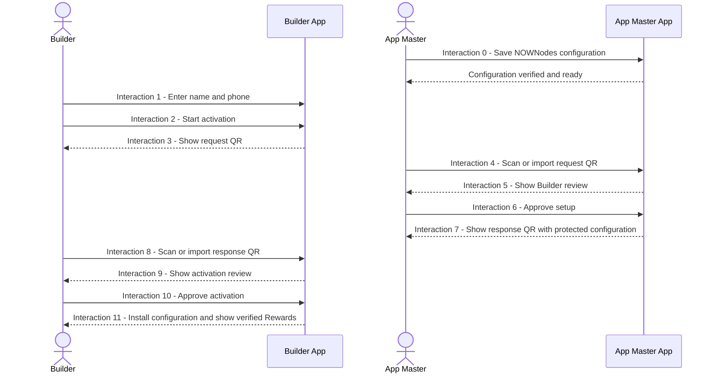
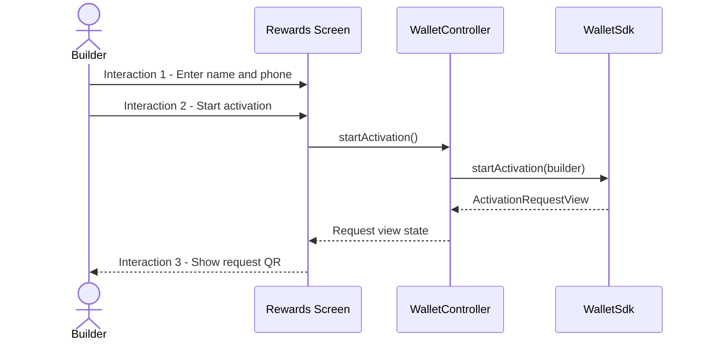
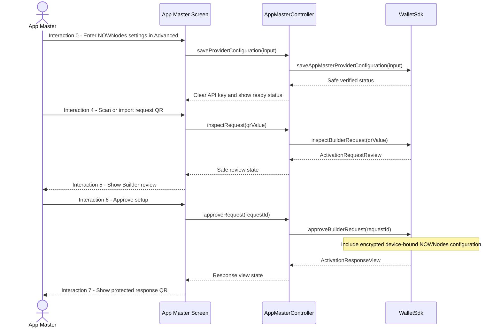
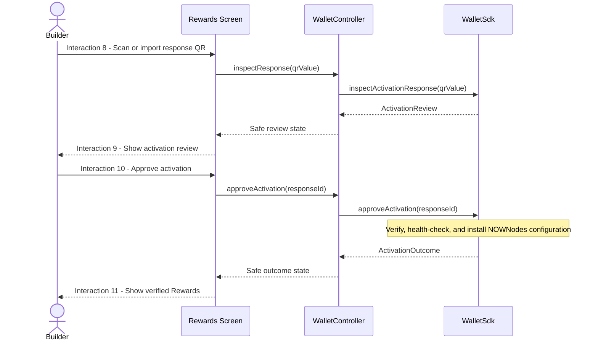
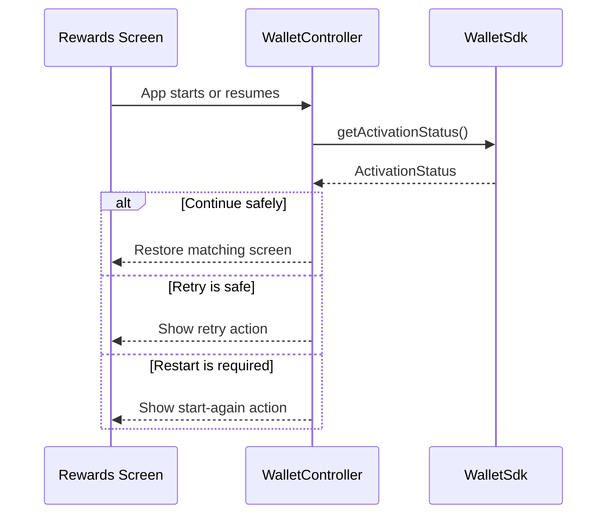

# Wallet Sub-Feature 01 — Layer Sequence Diagrams

The Wallet SDK is intentionally a black box. These diagrams show only the interface available to application developers. NOWNodes is named only in App Master Advanced; Builder-facing screens continue to use plain Rewards language.

## 0. Builder and App interaction sequence

## 1. Create activation request

## 2. App Master prepares response

## 3. Builder completes activation

## 4. Failure and restoration

No application-layer diagram expands the Wallet SDK internals.
